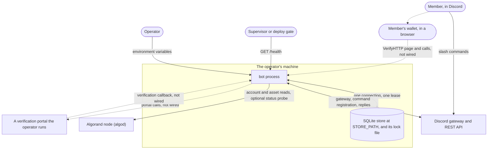
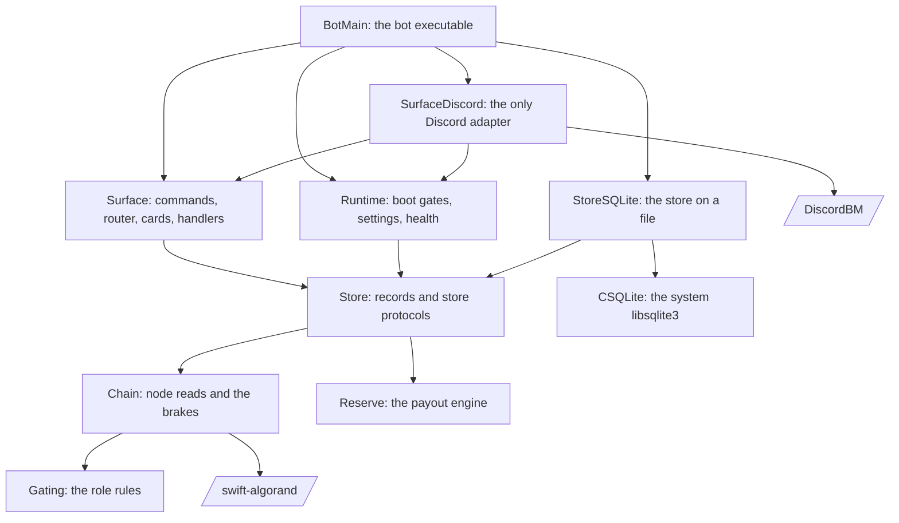
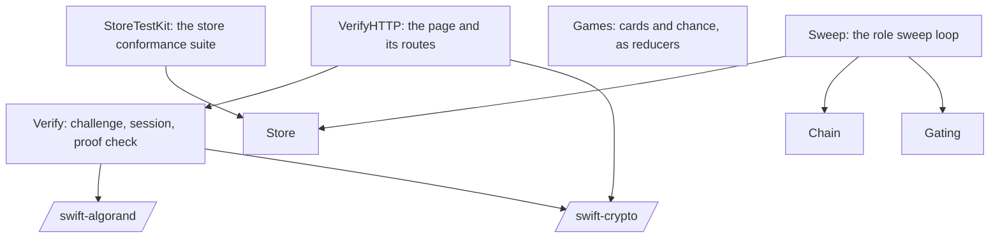
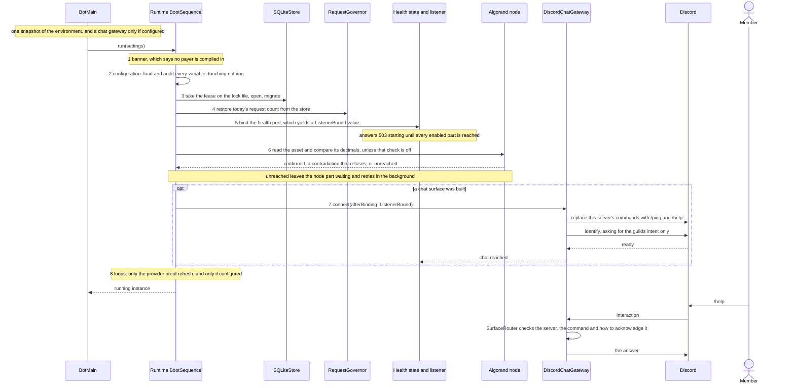
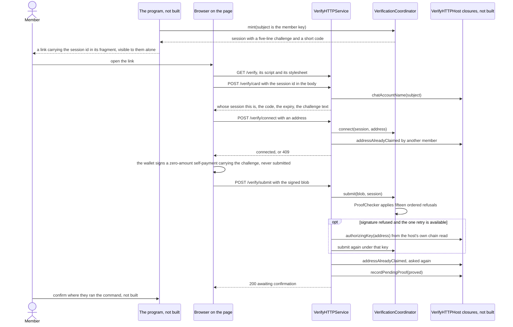
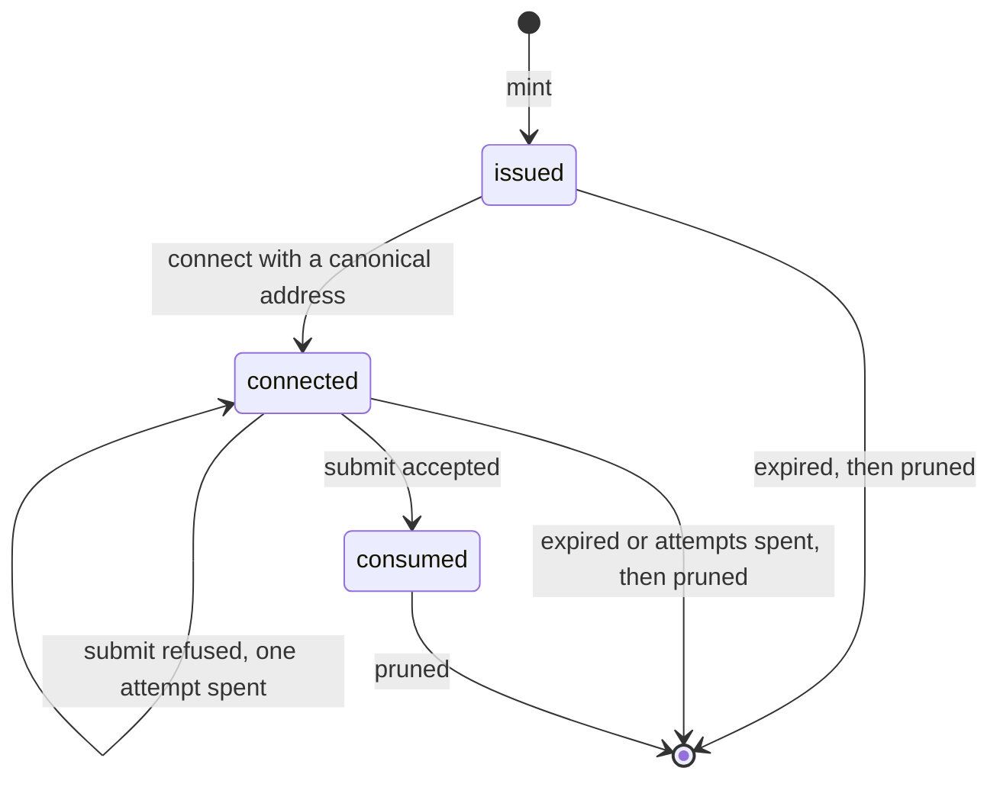
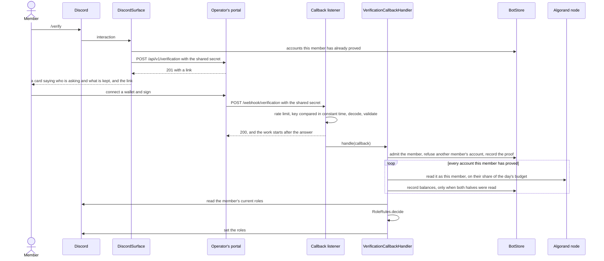
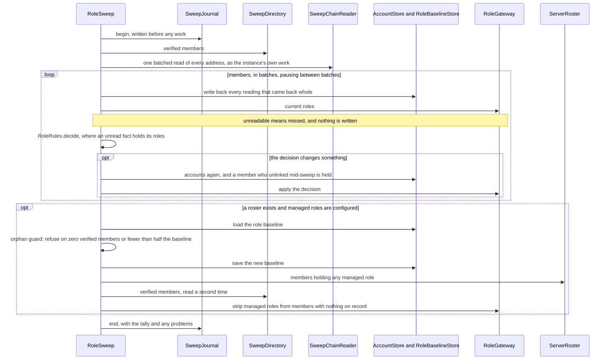
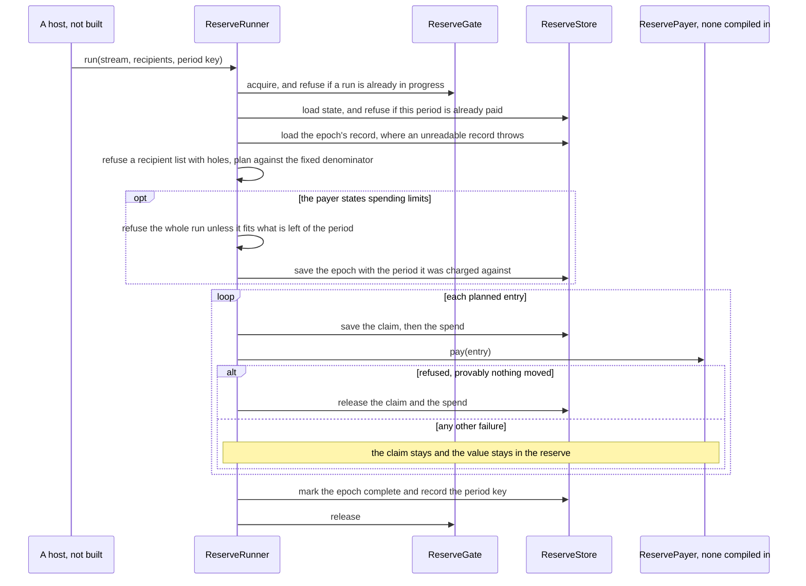
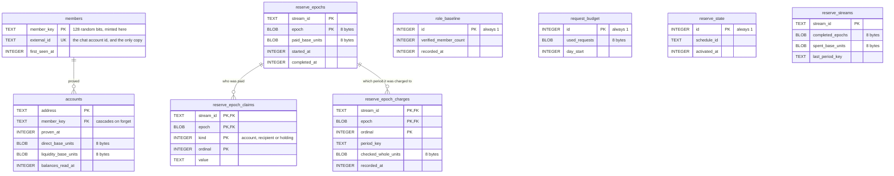

# High-level design

How the pieces of this package fit together, drawn from the code at the commit
this file sits in. It is for somebody about to change the code, or deciding
whether to trust it, who wants the whole shape before reading any one module.

**This document owns the shape and nothing else.** It says which target depends
on which, which seam each one declares and what fills it, the order things
happen in, and which parts the executable actually runs. Every other fact
already has an owner, and this file links to that owner instead of repeating it ([`README.md`](README.md)
says why that rule exists): a variable's meaning is in
[`CONFIGURATION.md`](CONFIGURATION.md), a host or a secret in
[`WHAT-IT-TALKS-TO.md`](WHAT-IT-TALKS-TO.md), a wire format in
[`VERIFICATION.md`](VERIFICATION.md), a module's exports and invariants in its
spec under [`../specs/`](../specs/), and what somebody wants in
[`../hi/`](../hi/). Where this file and one of those disagree, the owner is
right and this file is the bug.

## How to read it

Every part is in one of three states, and the drawings keep them apart
([BUILD-4](../hi/build.md)). This repository is early, and a diagram that draws
everything the same way reads as though it all runs.

| State | What it means | Drawn as |
|-------|---------------|----------|
| **Runs** | Reached from `swift run bot` at this commit. | A solid line |
| **Built, not wired** | Compiled, exported and tested, and nothing in the executable constructs it. | A dotted line, or a note saying so |
| **Not built** | An obligation or a later piece with no code yet. | Named in a note, never drawn as a box that works |

What is missing, as a list, is owned by
[`../README.md`](../README.md#what-is-missing). The flows below say which state
each step is in.

## 1. Purpose

A Discord bot for Algorand projects, run by one operator for one community's
server ([HOST-6](../hi/host.md), [HOST-10](../hi/host.md)). A member proves an
account is theirs by signing a challenge in their own wallet, and no key or
seed phrase ever reaches the bot ([VERIFY-1](../hi/verify.md)). The bot reads
what that account holds from a node the operator chooses. The roles beside the
member's name follow the rules the operator configured, and a periodic sweep
keeps them true after somebody sells ([ROLE-1](../hi/role.md)). Holders can be
paid from a finite reserve on a schedule ([RESERVE-1](../hi/reserve.md)).
[`../INTENT.md`](../INTENT.md) is the why, family by family.

At this commit the executable boots, opens its store, checks the operator's
asset against their node and answers a health endpoint. Given a Discord token
and a server, it also registers `/ping` and `/help` and answers them.
Verification, the role sweep and the payout engine are each built and tested.
None of them is wired into the executable yet.

## 2. Context

Solid lines run today. The two Discord edges exist only when
`DISCORD_BOT_TOKEN` and `DISCORD_GUILD_ID` are set. With neither set, the
process identifies to nothing. The dotted lines are the two routes to
verification that are built and not assembled into the executable.
[`decisions/0001`](decisions/0001-verification-portal.md) is the open question
of which one ships. The exact hosts, requests, headers and secrets on every
edge are in [`WHAT-IT-TALKS-TO.md`](WHAT-IT-TALKS-TO.md). Nothing here signs or
submits a transaction, and no edge goes to whoever wrote the software.

## 3. Components

Fifteen targets in one Swift package. [`../Package.swift`](../Package.swift)
owns the graph, with a comment beside every edge saying why it exists. The two
drawings below are derived from it. The first is what the executable links,
and the second is what only tests link.

### 3.1 What `bot` links

Every edge out of `BotMain` is drawn, because it is the one place the halves
meet. Below it, an edge that another drawn path already implies is left out.
`Surface` also declares `Gating` and `Chain`, for example, and reaches both
through `Store`. The manifest has the full list.

The manifest states three rules about this shape, each beside the edge that
enforces it.

- **Only `SurfaceDiscord` names the chat library.** `SurfaceDiscord` depends
  on `Runtime` and on `Store`, and SwiftPM refuses a cycle, so neither of those
  can ever import it. That is what keeps a member a plain `String` below the
  chat boundary.
- **`Runtime` links no chat SDK and no database.** It declares seams over
  Foundation types and takes the store as `any BotStore`. `BotMain` is where
  the concrete ones are chosen.
- **`Reserve` is linked and never driven.** `Store` depends on it for the
  ledger protocol the store implements. Nothing in the executable builds a
  `ReserveRunner`, and no payer exists outside the tests
  ([BUILD-3](../hi/build.md)).

The linked set also contains code the executable never reaches.
`SurfaceDiscord` holds `DiscordSurface`, the assembly that carries `/verify`,
`/unlink`, the portal client and the callback listener (§4.3). `BotMain`
builds `DiscordChatGateway` instead, with `/ping` and `/help` only
([`../Sources/SurfaceDiscord/DiscordChatGateway.swift`](../Sources/SurfaceDiscord/DiscordChatGateway.swift)).

### 3.2 What only tests link

Each edge here is exactly as declared. `Store`, `Chain` and `Gating` are the
same targets as above.

- **`Verify` and `VerifyHTTP` touch no other target in this package.** The
  verification half cannot record a member, spend a chain request or reach
  Discord by itself. What it needs from a host arrives as four closures
  (`VerifyHTTPHost`).
- **`Games` depends on nothing.** No game can reach a chain, a store or
  anything of value.
- **`Sweep` declares its own chat seam over `String`**, so it links no chat
  SDK. Nothing in the package satisfies that seam yet (§3.3).
- **`StoreTestKit` is a plain target that no product reaches**, so the
  conformance suite never ships.

### 3.3 The seams

Each module is written against protocols it declares, and the program fills
them. This table is the quickest way to see what is real. A seam with nothing
behind it is a feature that cannot run.

| Seam | Declared in | Filled at this commit by | Reached from `bot` |
|------|-------------|--------------------------|--------------------|
| `ChatGateway` | `Runtime` | `DiscordChatGateway`. Also `DescribedChatSurface`, which only describes its variables for `bot check`. | Yes, when a token and a server are set |
| `StoreOpening` | `Runtime` | `DurableStoreOpener`, over `SQLiteStore` | Yes |
| `ChainSourceProviding` | `Runtime` | `NodeChainSource` | Yes |
| `RuntimeOutput` | `Runtime` | `StandardStreams` | Yes |
| `BotStore`: members, accounts, role baseline, payout ledger, request budget | `Store` | `SQLiteStore`, and `InMemoryStore` | Yes, `SQLiteStore` |
| `AccountDataSource` | `Chain` | `NodeAccountDataSource` | Yes |
| `HTTPHeaderProbe` | `Chain` | `URLSessionHeaderProbe` | Only when `CHAIN_PROOF_HEADERS` is set |
| `ChatSession`, `GuildMemberRoles`, `InteractionReplying` | `SurfaceDiscord` | `DiscordGatewayConnection`, `DiscordGuildMemberRoles`, `ReplySending` | Yes, inside the chat gateway |
| `CommandRegistrar` | `Surface` | `DiscordCommandRegistrar` | Yes, inside the chat gateway |
| `ReserveStore` | `Reserve` | `SQLiteStore` and `InMemoryStore` through `BotStore`, and `InMemoryReserveStore` | The store is open. Nothing runs against it |
| `ReservePayer` | `Reserve` | A recording double in `StoreTestKit`, and nothing else | No |
| `VerificationClient` | `Surface` | `HTTPVerificationClient` | No |
| `AccountHoldingsReader` | `Surface` | `ChainAccountReader` | No |
| `RoleApplier` | `Surface` | `DiscordRoleApplier` | No |
| `VerificationSessionStore` | `Verify` | `InMemoryVerificationSessionStore` | No |
| `VerifyHTTPHost`: chat account name, address already claimed, authorising key, record pending proof | `VerifyHTTP` | Nothing | No |
| `SweepDirectory` | `Sweep` | `StaticSweepDirectory`, a fixed list | No |
| `SweepChainReader` | `Sweep` | `BatchedSweepReader`, over `Chain` | No |
| `CollectionRegistry` | `Sweep` | `StaticCollectionRegistry` | No |
| `SweepJournal` | `Sweep` | `InMemorySweepJournal`, lost on restart | No |
| `RoleGateway` | `Sweep` | Nothing. It has the same two methods as `RoleApplier`, with no compiler link between them | No |
| `ServerRoster` | `Sweep` | Nothing | No |

The gaps behind the empty rows are written down where they will be closed:
[`../specs/sweep/tasks.md`](../specs/sweep/tasks.md) and the "Left for the
program" list in
[`../specs/verify-http/tasks.md`](../specs/verify-http/tasks.md).

## 4. Key flows

Five flows. Only the first runs today, and each heading says which state its
flow is in.

### 4.1 Starting, and answering a command (runs)

`bot run` walks eight gates in an order no setting can change
([`../Sources/Runtime/BootGate.swift`](../Sources/Runtime/BootGate.swift) gives
the reason for each position). The exit codes a refusal stops with are listed
in [`../README.md`](../README.md#what-the-binary-takes).

Three orderings in that drawing are load-bearing.

- **The store comes before the socket.** The lease asks the exact question,
  which is whether another instance is using *this data*. A port clash only
  approximates it, and gets it wrong on a machine hosting several communities
  that each have their own store and port ([RUN-7.a](../hi/run.md)).
- **Nothing can identify before the bind.** The chat gateway's only way in
  takes a `ListenerBound`, and only the composition root can make one. The
  wrong order does not compile. If a second copy identified and then died on
  the bind, Discord would drop the live copy's session ([RUN-7](../hi/run.md)).
- **Health is raised by the gateway's own ready event**, not by the connect
  call returning, and it is lowered again when the session ends
  ([SEE-1.a](../hi/see.md)). A bound socket is not a healthy bot.

Shutting down runs the other way
([`../Sources/Runtime/RunningInstance.swift`](../Sources/Runtime/RunningInstance.swift)).
The chat session leaves first, after waiting for any answer still in flight.
Then background tasks are cancelled and awaited, the listener stops, the day's
request count is flushed, and the store closes, which releases the lease. A
second signal exits at once.

### 4.2 Proving an account in process (built, not wired)

`Verify` decides whether a signature proves an account and reads nothing to do
it: no clock, no network, no store and no setting. `VerifyHTTP` is the page
and the routes a member's browser reaches. Neither is linked into `bot`, and
the program's half of the flow is not built. That half is marked below.

What the drawing compresses:

- **Every route is rate limited** per source, and the three calls are also
  limited per session. A request carrying any query string is refused before
  the limiter is asked, because the session id must never be in one. Unknown
  paths are not counted. The figures are in
  [`../Sources/VerifyHTTP/VerifyHTTPLimits.swift`](../Sources/VerifyHTTP/VerifyHTTPLimits.swift).
- **The page interpolates no value and loads no third-party script.** It
  ships no wallet connector. An operator drops in their own, or the member
  pastes a signed transaction
  ([`../specs/verify-http/verify-http.spec.md`](../specs/verify-http/verify-http.spec.md)).
- **A refusal carries a reason and a handle**, which is a digest of the
  session, never the session id itself.
- **The accepted shape, and the order of the fifteen refusals**, are in
  [`VERIFICATION.md`](VERIFICATION.md#two-routes-and-the-bot-half-is-the-same-either-way)
  and [`../specs/verify/verify.spec.md`](../specs/verify/verify.spec.md).

A session moves through three states, and time ends it in any of them.

A session refuses a second, different address once one is connected, and
refuses a call while another call on the same session is in progress. The
attempt limits per session and per subject are in
[`../Sources/Verify/VerificationLimits.swift`](../Sources/Verify/VerificationLimits.swift).

### 4.3 The portal route (built, not reached)

This is the older design, and the one [`VERIFICATION.md`](VERIFICATION.md)
specifies. A portal the operator runs takes the signature and calls the bot
back. `DiscordSurface` assembles it, with its own boot. That boot opens the
store, binds the health port and the callback port, checks the portal's health
and whether both sides hold the same shared secret, and only then registers
the commands and identifies. The executable never builds `DiscordSurface`, and
its settings audit refuses every `VERIFY_` variable by name. Configuration
cannot switch this route on.

On this route the shared secret is the whole trust boundary: the bot holds the
portal's word, not a proof it checked itself. The portal's number is used only
as a starting value and never decides a role.
[`VERIFICATION.md`](VERIFICATION.md) owns every status, the transport
constraint on the callback, and what a conforming portal must and must never
do.

### 4.4 The role sweep (built, not wired)

`RoleSweep` re-reads what every verified member holds and moves their roles to
match. The decision is `Gating`'s `RoleRules.decide`, and the sweep does not
repeat it. Nothing in the package constructs a `RoleSweep`, and gate 8 starts
no sweep. Until something wires it in, a member who sells keeps their rung.

- **One pass at a time.** A second `run()` while one is in progress does
  nothing and says so. The loop in `start(interval:)` waits out the rest of an
  interval when the journal says a sweep ran recently. The default interval is
  in [`../Sources/Sweep/SweepSchedule.swift`](../Sources/Sweep/SweepSchedule.swift).
- **The instance's own reads carry no member share.** They are bounded by
  batch size and interval instead, and they spend the same day's budget as
  every other read.
- **A role outside the managed set is never touched**, and a fact nobody could
  read manages nothing ([ROLE-1.a](../hi/role.md)).
- **What wiring it needs** is written down in
  [`../specs/sweep/tasks.md`](../specs/sweep/tasks.md): a directory backed by
  the store, a roster that lists server members, a `RoleGateway` conformance,
  a durable journal, and a start from gate 8.

### 4.5 Paying one epoch of a stream (built, never driven)

`ReserveRunner` plans an epoch and hands each entry to a `ReservePayer`. It
never sends anything itself, and no payer is compiled into this build.
[`../README.md`](../README.md#the-reserve-engine) owns the arithmetic and why
each guard exists. The drawing shows where each guard sits.

The claim-before-pay order is only as good as the store's promise that a save
is on disk before it returns. In `StoreSQLite` that order is enforced by the
compiler as well. The write scope takes a synchronous body and a payment is
`async`, so a payment cannot be moved inside a commit.

## 5. Data

### 5.1 The store

One SQLite file per instance, at `STORE_PATH`, built by three migrations in
[`../Sources/StoreSQLite/Schema.swift`](../Sources/StoreSQLite/Schema.swift).
The drawing shows only the foreign keys the schema actually declares.
`reserve_epochs.stream_id` names a stream by value and declares no key.

Rules the schema itself enforces with checks, not comments:

- **An amount is eight bytes, most significant first**, never a signed
  integer and never a floating-point number, so the payout engine's saturating
  arithmetic fits.
- **An instant is whole seconds since 1970 UTC**, stored as an integer.
- **Forgetting a member is deleting their `members` row.** The cascade removes
  their accounts, and a test asserts that every table carrying a member key
  declares it. That row is the only place the minted key and the chat account
  id appear together ([VERIFY-7](../hi/verify.md), [HOST-2](../hi/host.md)).
- **Claims do not cascade to members, on purpose.** A slot already paid stays
  recorded after the member is forgotten, or a resumed run pays it again
  ([RESERVE-10](../hi/reserve.md)). The value there is a minted key, not
  anything that came from a person.
- **Singletons are constrained to `id = 1`**, so a second baseline, budget or
  reserve state cannot quietly become the one that is read.

The durability settings are read back at open, and a mismatch stops the start.
They are write-ahead logging, `synchronous = FULL` and a full flush on Darwin,
all on one connection. An exclusive lease on a sibling `.lock` file is taken
before the database opens. A volume on a network filesystem is refused
([`../Sources/StoreSQLite/SQLiteStore.swift`](../Sources/StoreSQLite/SQLiteStore.swift),
[`../Sources/StoreSQLite/DurableVolume.swift`](../Sources/StoreSQLite/DurableVolume.swift)).
What the store deliberately does not keep yet, and what would have to read it,
is listed in [`../specs/store/store.spec.md`](../specs/store/store.spec.md).

### 5.2 What lives only in memory

| What | Where | Lost on restart |
|------|-------|-----------------|
| Verification sessions and per-subject tallies | `InMemoryVerificationSessionStore` | Yes. A member runs the command again. |
| The last sweep record and recent problems | `InMemorySweepJournal` | Yes, and the spec says so ([SEE-2](../hi/see.md) is not met yet) |
| Rate limiter windows, and the per-member share of the day | `VerifyRateLimiter`, the callback limiter, `CallerShare` | Yes |
| Cached account readings and pool reserves | `WalletCheckCache`, `ExpiringMap` in `Chain` | Yes |
| Which health components have been reached | `HealthState` | Yes, and it starts at `starting` |
| The day's request count | `RequestGovernor` | **No.** It is written to `request_budget` every so many requests and restored at gate 4 ([RUN-8.b](../hi/run.md)) |

### 5.3 On chain

Reads only, and only two kinds: an account, meaning what it holds, and an asset,
meaning its details. A pool's reserves take one of each: the pool token's
details, then the pool's own account. The bot writes nothing, holds no chain
key, and never submits the proof transaction a member signs. A read that did not come back is **unknown**, not zero. `ChainReading`
and `Gating.Reading` carry that difference all the way to the decision, where
an unknown fact holds the roles it would have decided.

## 6. Runtime and deployment

- **Build.** SwiftPM, tools version 6.1, with the platforms and the one system
  library (`libsqlite3`, from the operating system) in
  [`../Package.swift`](../Package.swift). `Package.resolved` is committed, so
  two clones of one commit build the same code ([TRUST-4](../hi/trust.md)).
- **Run.** One executable, `bot`, with four verbs: `run`, `check`, `rehearse`
  and `help`. The README owns what each does and the exit codes. All
  configuration comes from environment variables, read once as one snapshot in
  `BotMain` and nowhere else ([`CONFIGURATION.md`](CONFIGURATION.md)).
- **Listen.** One socket, `GET /health` on `HEALTH_ADDRESS` and `HEALTH_PORT`.
  It answers `503` with a list of what it is still waiting for until every
  enabled part has been reached, then `200`. The parts are the store, the node
  (unless the decimals check is off) and the chat session (when a surface is
  built). It reads nothing and spends no chain request to answer. A listener
  that dies stops the whole instance, so a supervisor restarts it cleanly
  rather than keeping a process that answers for nothing.
- **Many communities, one machine.** Each instance gets its own store and its
  own port. There is no default for either, and the lease refuses two
  instances on one store.
- **CI.** Two workflows, both on GitHub-hosted runners so that a fork's pull
  request never runs on a maintainer's machine.
  [`tests.yml`](../.github/workflows/tests.yml) builds and tests on macOS and
  in a Linux container at the tools version, and runs only when code, tests,
  the manifest or the lock change. [`trust.yml`](../.github/workflows/trust.yml)
  runs the CorvidLabs Trust gate, pinned by commit, on every pull request and
  on every push to `main`. That gate is the verify lane in
  [`../fledge.toml`](../fledge.toml) plus the SpecSync contract check and a
  risk score, configured in [`../.trust.toml`](../.trust.toml).
- **Release.** Nothing has been released and there are no tags.
  [`../CONTRIBUTING.md`](../CONTRIBUTING.md#releases) owns how the first one
  will be cut.
- **Deployment.** Unknown: this repository ships no container image, Dockerfile
  or deploy manifest. The README says the target is a Linux container, and the
  contract with whatever runs it is the exit codes and `/health`.

## 7. Security and trust boundaries

| Boundary | What holds it |
|----------|---------------|
| **The chat boundary** | Only `SurfaceDiscord` knows what a snowflake is. Below it a member is a key the instance minted from random bits. Chain reads, the payout ledger and logs carry that key, never an identifier that came from a person. |
| **No keys** | Nothing in the repository holds a chain key or calls a submit. `Verify` checks an Ed25519 signature against the public key that *is* the address, with `swift-crypto`, because the only check `swift-algorand` offers lives on a type that holds a private key. A proof carrying a rekey, close or group field is refused even when its signature is good. |
| **No spending** | No payer is compiled in, the banner says so on every start, and no variable changes it ([BUILD-3](../hi/build.md)). |
| **Secrets** | `DISCORD_BOT_TOKEN`, and `CHAIN_API_TOKEN` when the provider needs one. Neither is ever printed, and refusal lines pass through `SecretRedaction` first. The disclosure is [`WHAT-IT-TALKS-TO.md`](WHAT-IT-TALKS-TO.md#secrets-and-everything-else-it-reads). |
| **Settings** | A required variable that is missing is a refusal naming it ([ADOPT-6](../hi/adopt.md)). A variable nothing reads is reported. A variable in a prefix reserved for a part this build does not have stops the boot. At this commit that is every `VERIFY_` variable. |
| **Inbound traffic** | An interaction from any server but the configured one is refused. The command catalogue is validated offline before registration. The health listener accepts only the request line. `VerifyHTTP` refuses query strings, bounds bodies, rate limits every route, and logs a digest handle rather than a session id. |
| **Chain reads** | Every read names whose it is, with no default. A member's reads are rationed to a share of the day's budget, and the instance's own work is bounded by batch size and interval instead. The health path spends nothing. |
| **Verification** | In process, the bot holds a proof it checked itself. On the portal route it holds the portal's word, and the shared secret is the whole boundary ([`VERIFICATION.md`](VERIFICATION.md#authentication)). The session id is a bearer credential: it lives in a fragment, never in a query string or a log. |
| **Supply chain** | Three direct dependencies, pinned to a narrow range, with the lock committed. The graph and what cannot be checked by grepping are in [`WHAT-IT-TALKS-TO.md`](WHAT-IT-TALKS-TO.md#what-this-document-cannot-tell-you). |

## 8. Failure modes and limits

Each row names the part that decides the outcome. The figures live in the files
linked, not here.

| When | What happens | Where it is decided |
|------|--------------|---------------------|
| A variable is wrong or missing | The boot stops at gate 2, naming the variable, before any lock, socket or request | `Runtime` configuration gate |
| Another instance holds the store | Refused at gate 3. The copy already serving keeps serving | `InstanceLease` |
| The health port is taken | Refused at gate 5, before anything identifies | `HealthListener` |
| The store is on a network filesystem | Refused at open, not discovered after a power cut | `DurableVolume` |
| The node does not answer at boot | The instance stays up, reports `starting`, and retries in the background | `ChainGate` |
| The node contradicts the configured decimals | Refused at gate 6 | `ChainGate` |
| The day's request budget is spent | Reads are refused. Readings come back unknown and roles are held, not stripped | `RequestGovernor`, `Gating` |
| One member reads too often | Their reads are refused until their share refills. Nobody else is affected | `CallerShare` |
| Discord closes the session and will not retry | Health drops to `503`. The process stays up and says it is deaf | `DiscordChatGateway` |
| A command handler is slow | Each interaction is answered in its own task, so the next member is not held up | `DiscordChatGateway` |
| A member's current roles cannot be read | Nothing is changed for that member | `RoleSweep`, `VerificationCallbackHandler` |
| The sweep's view of the store looks wrong | The orphan pass refuses when zero members are verified or the count fell below half the baseline | `RoleRules.orphanSweep` |
| A payout run overlaps another, repeats a period, or would exceed a limit | The whole run is refused before the first payment | `ReserveRunner` |
| A payment fails ambiguously | The claim is kept and the value stays in the reserve. It is never retried | `ReserveRunner` |
| The first shutdown signal | An orderly stop, in the order in §4.1 | `RunningInstance` |
| A second signal | Immediate exit | `BotMain` |

## 9. Decisions

- **[0001, how a member proves an account is theirs](decisions/0001-verification-portal.md)**:
  proposed, not decided. It recommends that the bot serve the page itself (its
  option D1), keeping the portal contract so an operator can substitute their
  own. `Verify` and `VerifyHTTP` are the code that option would use. Neither
  is wired, and nothing on `main` takes the decision.
- **Engine first.** The payout engine was built and pinned by tests before any
  Discord code, because a transfer cannot be taken back
  ([`../README.md`](../README.md#why-the-engine-first)).
- **Carried in code and specs rather than in a record**, each with its reason
  beside it: the gate order ([`../Sources/Runtime/BootGate.swift`](../Sources/Runtime/BootGate.swift)),
  the dependency directions ([`../Package.swift`](../Package.swift)), the
  fixed denominator and claim-before-pay ([`../specs/reserve/`](../specs/reserve/)),
  unknown is not zero ([`../specs/gating/`](../specs/gating/),
  [`../specs/chain/`](../specs/chain/)), and the operating system's SQLite
  rather than a vendored one ([`../specs/store/`](../specs/store/)).
- **Intent before contract before code.** [`../AGENTS.md`](../AGENTS.md) owns
  that order and the change lifecycle that checks it.

## 10. Glossary

| Term | Meaning here |
|------|--------------|
| Member key | The 128-bit random name an instance gives a member the first time they prove anything. It is the only member identifier below the chat boundary. |
| Subject | The member key, as it appears in a verification challenge and session. |
| Challenge | The five lines a member's wallet shows and signs as the note of a zero-amount self-payment. |
| Authorising key | The key an account is rekeyed to. It is read from the chain by the host, at most once per session. |
| Ladder, tier, rung | The operator's numbered thresholds of holding, each with a role. |
| Collection, pool | NFT collections and liquidity pools the operator counts, each with its own role rules. |
| Managed role | A role the operator configured. Every other role is never touched. |
| Unknown | A fact nobody could read. It is not zero and not empty, and it decides nothing. |
| Orphan | A server member who holds a managed role and has nothing on record. |
| Baseline | The verified-member count the last sweep recorded, which the orphan guard compares against. |
| Reserve, stream, epoch, period | The finite pot, a named slice of it, one payout of that slice, and the calendar key (an ISO week, a month) that stops an epoch being paid twice in one period. |
| Claim | The record, written before a payment, that a slot has been paid in this epoch. |
| Payer | Whatever actually moves value. None is compiled into this build. |
| Caller | Whose a chain read is: a member's, rationed, or the instance's own, unrationed. |
| `ListenerBound` | The value a successful bind returns. Nothing can identify to Discord without one. |
| Portal | A separate web service that takes the signature and calls the bot back, specified in [`VERIFICATION.md`](VERIFICATION.md). |
